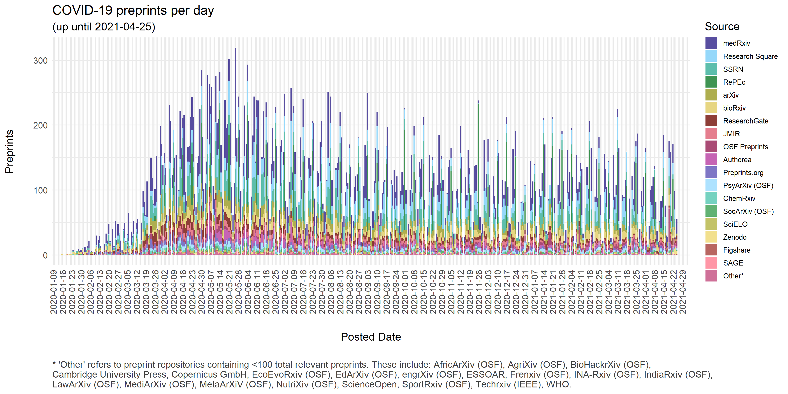
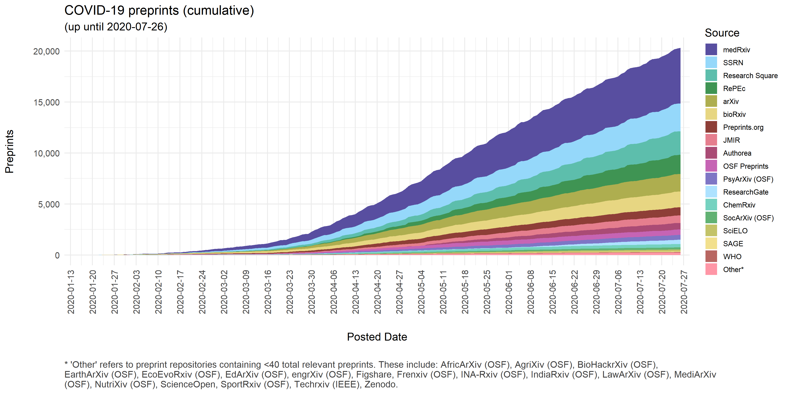

# COVID-19 Preprints

This repository contains code used to extract details of preprints related to COVID-19 and visualize their distribution over time. Work by [Nicholas Fraser](https://orcid.org/0000-0002-7582-6339), with thanks to [Bianca Kramer](https://orcid.org/0000-0002-5965-6560) for improving the visualisations.

A citable version of this repository is also available on figshare, here: [https://doi.org/10.6084/m9.figshare.12033672](https://doi.org/10.6084/m9.figshare.12033672).

The process for collecting preprint metadata is documented fully in the Rmarkdown file [covid19_preprints.Rmd](covid19_preprints.Rmd). In brief, preprint metadata are harvested from two sources: Crossref (using the [rcrossref](https://github.com/ropensci/rcrossref) package) and arXiv (using the [aRxiv](https://github.com/ropensci/aRxiv) package). With respect to Crossref, all records with the `type` field defined as `posted-content` are included, as well as records from SSRN (where the `type` field is instead defined as `journal-article`). Preprints records are then matched to known preprint repositories based on `institution`, `publisher` and `group-title` fields, and filtered for partial matches to keywords relating to COVID-19 ("coronavirus", "covid-19", "sars-cov", "ncov-2019", "2019-ncov") in either their titles or abstracts. In some cases, multiple Crossref records are registered for a single preprint (e.g. ChemRxiv registers a new Crossref record for each new version of a preprint). In these cases, only the earliest posted version is included in this dataset. Additionally, some preprints are deposited to multiple preprint repositories - in these cases all preprint records are included. With respect to arXiv, records are harvested by searching directly for COVID-19 related keywords in titles or abstracts using the built-in search functionality of the `aRxiv` package.

  

