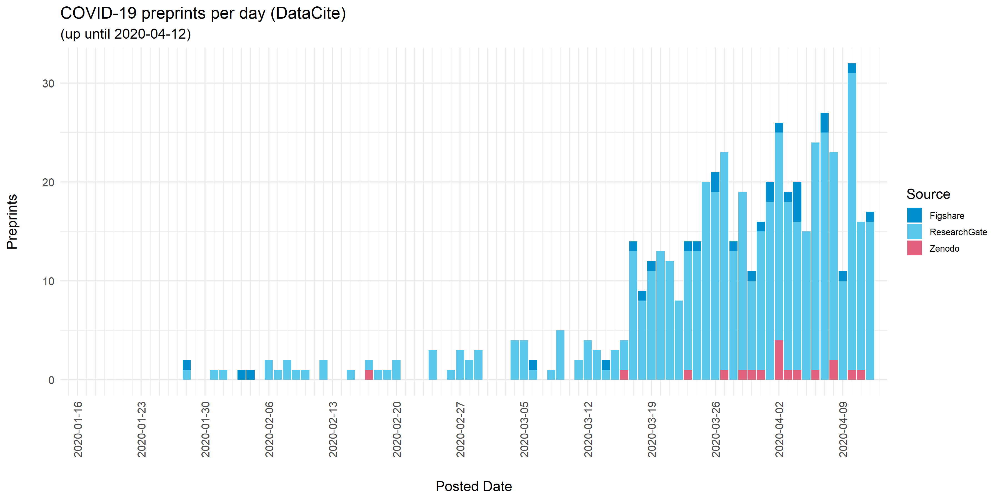
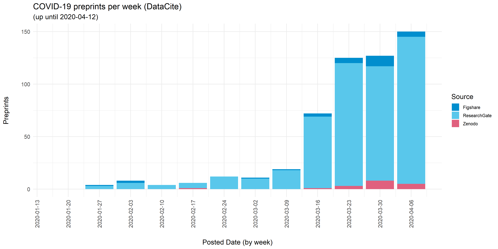
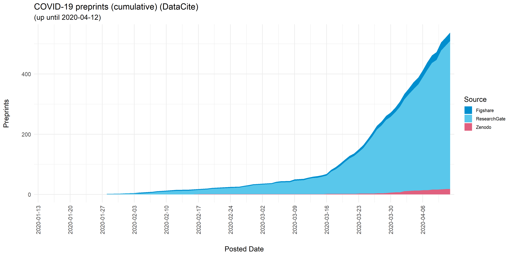

# COVID-19 Preprints - DataCite

This repository branch adds preprints with [DataCite](https://datacite.org/) DOIs to the work of [Nicholas Fraser](https://orcid.org/0000-0002-7582-6339) extracting details of preprints related to COVID-19 and visualizing their distribution over time - as shared in the GitHub repository [COVID19 Preprints](https://github.com/nicholasmfraser/covid19_preprints)

The process for collecting DataCite preprint metadata is documented fully in the Rmarkdown file [covid19_preprints_datacite.Rmd](covid19_preprints_datacite.Rmd). In brief, preprint metadata are harvested from DataCite (using the [rdatacite](https://github.com/ropensci/rdatacite) package). All records with the `resourceType` field defined as `Preprint` are included. Preprints records are matched to known preprint repositories based on `client` fields, and filtered for partial matches to keywords relating to COVID-19 ("coronavirus", "covid-19", "sars-cov", "ncov-2019", "2019-ncov") in either their titles or abstracts. In some cases, multiple records are registered for a single preprint. In these cases, only the earliest posted version is included in this dataset. Preprints might be deposited to multiple preprint repositories - in these cases all preprint records are included.

  

