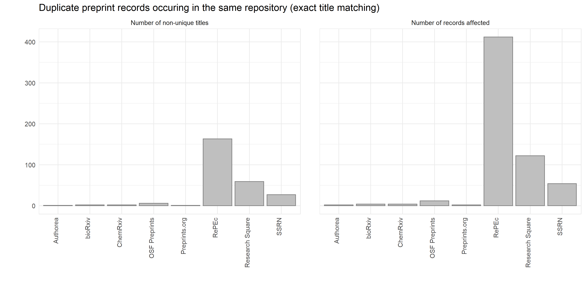
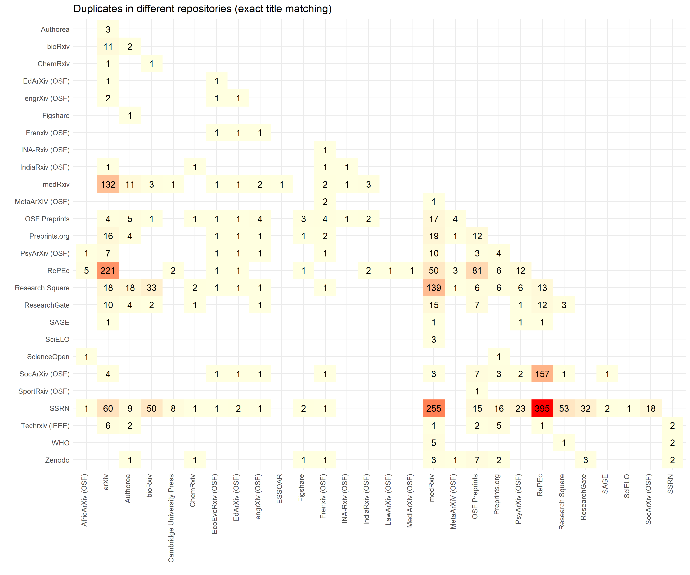

# COVID-19 Preprints

This repository contains code used to extract details of preprints related to COVID-19 and visualize their distribution over time. Work by [Nicholas Fraser](https://orcid.org/0000-0002-7582-6339) and [Bianca Kramer](https://orcid.org/0000-0002-5965-6560). 

Preprint data is currently updated on an (approximately) weekly schedule - details of these releases can be found in `data/metadata.json`, where `release_date` refers to the date on which data was collected, and `sample_date` the cut-off point for preprints to be included based on their posting date.

A citable version of this repository is also available on figshare, here: [https://doi.org/10.6084/m9.figshare.12033672](https://doi.org/10.6084/m9.figshare.12033672).

Note that this dataset is not exhaustive, but aims to collate information from some of the main sources of preprint metadata.

## Data Collection Process

The process for collecting preprint metadata is documented fully [here](covid19_preprints.md). In general terms, preprint metadata are harvested from four main sources: 

* Crossref (using the [rcrossref](https://github.com/ropensci/rcrossref) package). All records with the `type` field defined as `posted-content` are harvested, as well as records from SSRN (where the `type` field is instead defined as `journal-article`). Preprint records are then matched to known preprint repositories based on `institution`, `publisher` and `group-title` metadata fields.

* DataCite (using the [rdatacite](https://github.com/ropensci/rdatacite) package). All records with the `resourceType` field defined as `Preprint` are harvested.  Preprint records are matched to known preprint repositories based on `client` fields.

* arXiv (using the [aRxiv](https://github.com/ropensci/aRxiv) package). Records are harvested by searching directly for COVID-19 related keywords in titles or abstracts using the built-in search functionality of the arXiv API.

* RePEc (using the [oai](https://github.com/ropensci/oai) package)). All record types are initally harvested, and subsequently filtered for those with the `Type` field defined as `preprint`. NB: RePEc is not a preprint server in itself but an indexing server for multiple individual archives. A full list of these contributing archives can be found [here](https://ideas.repec.org/archives.html).

For all sources, preprints are classified as being related to COVID-19 on the basis of keyword matches in their titles or abstracts (where available). The search string is defined as: `coronavirus OR covid-19 OR sars-cov OR ncov-2019 OR 2019-ncov OR hcov-19 OR sars-2`.

## Visualisations

## Duplication of preprint records

In this dataset we aim to include a single entry for each individual preprint contained in repositories harvested from the above sources. In some cases, multiple versions of an individual preprint are registered in the same repository. Where these links are unambiguously identified through persistent identifiers (e.g. [bioRxiv](https://www.biorxiv.org/) uses the same DOI for each preprint record and updates the Crossref metadata accordingly, whilst [ChemRxiv](https://chemrxiv.org/) registers a new Crossref record for each new version of a preprint and appends a version number to the end of the DOI), only the earliest posted version is included in this dataset.

In some preprint repositories, detection of subsequent versions (or duplicates) is not unambiguous and must be inferred from similarity of titles or other metadata fields (e.g. from preprints having the same authors). An exploration of these within-repository duplicates is shown in the figure below (see also [duplicates.Rmd](duplicates.Rmd)): the left panel shows the total number of non-unique titles within a single repository (exact, case-insensitive matching), the right panel the total number of affected preprint records. In this dataset, **we have not** removed these inferred duplicates, and thus any analyses based on this data should consider further relevant de-duplication efforts prior to reporting.

A secondary effect of tracking multiple preprint sources, is that some authors may deposit the same preprint in multiple preprint repositories. An exploration of these across-repository duplicates is shown in the figure below: the numbers in the heatmap refer to the total number of records shared between two preprint repositories based on exact title matching (case-insensitive). Note that these numbers also include within-repository duplicates as noted above; thus if two repositories both contain two separate duplicates of a preprint with the same title, a total of four duplicate records will be recorded here. As with the within-repository duplicates, **we have not** removed inferred across-repository duplicates from our dataset.

